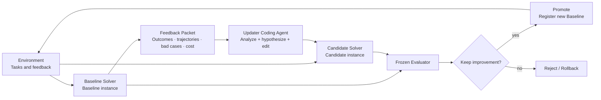

# DeepSeek Harness RSI

English | [中文](README.zh.md)

**An adapter-based recursive self-improvement control plane for coding agents, with DeepSeek Harness as the first Solver and Updater runtime.**

> [!IMPORTANT]
> The repository now has the independent control-plane layout, upstream submodule, adapter/isolation contracts, and an initial Benchmark validator plus paired Evaluator CLI. The full Controller evolution loop is not implemented yet, so this is not a claim of unattended self-evolution today.

## Why this is no longer a DeepSeek Harness fork

An RSI system must control source instances, Updaters, task environments, external evaluation, candidate lineage, and rollback. Keeping all of that inside a DeepSeek Harness fork mixes the system being optimized with the system judging it and makes other coding agents unnecessarily difficult to integrate.

The relationship is now:

```text
DeepSeek-Harness-RSI (independent trusted control plane)
  -> sources/deepseek-harness (read-only Git submodule of the official repo)
  -> .rsi/instances/... (Baseline and Candidate instances materialized by Controller)
  -> Updater edits one Candidate, never the source submodule
```

This preserves explicit upstream updates while allowing the same Controller to integrate other Solvers and Updaters through adapters.

## Core loop



**The Updater is not a collection of fixed diagnosis modules.** It is one coding-agent session that reads code and a batch of failure evidence, forms a hypothesis, and edits the candidate. The Controller handles deterministic materialization, permissions, execution, collection, evaluation, and promotion; it does not replace open-ended diagnosis with a fixed taxonomy.

## Mutation levels

| Level          | Writable in this run                                      | Isolation                         |
|----------------|-----------------------------------------------------------|-----------------------------------|
| L1 strategy    | Presets, prompts, personas, skills, tool descriptions     | Path allowlist; fast experiments  |
| L2 behavior    | Middleware, hooks, memory/router, workflows, tools/plugins | Isolated Candidate build and run |
| L3 Solver core | Agent loop, session/context, registries, adapters          | Full instance and regression isolation |
| External trust root | **Never writable at any level**                      | Separate process and storage      |

The Controller chooses one level per run. Prompt instructions explain the scope, while two enforcement gates provide the actual boundary: only allowed paths are writable in the Updater sandbox, and the Controller rejects any out-of-scope final diff.

## Repository layout

```text
.
├── controller/                 # Trusted orchestration contract and future implementation
├── adapters/
│   ├── targets/                # Solver source, launch protocol, and L1/L2/L3 paths
│   └── updaters/               # Coding-agent runtime used for an Updater session
├── benchmarks/                 # Pinned data revision, instance IDs, and three-way split
├── evaluation/                 # Paired metrics, promotion policy, normalized results
├── environments/              # Task, trajectory, and evaluation environment protocol
├── prompts/                    # Shared high-level Updater instruction
├── sources/
│   └── deepseek-harness/       # Pinned Harness integration; read-only to the Updater
├── docs/                       # Architecture and design documents
└── .rsi/                       # Local instances, feedback, artifacts, and lineage; ignored
```

## Source and instance isolation

- `sources/deepseek-harness/` stores the trusted, pinned upstream-derived source revision.
- The Controller materializes separate Baseline and Candidate worktrees from that revision.
- The Updater may read the Candidate, but only active-level paths are writable; Controller Git metadata is not exposed.
- Baseline and Candidate run paired tasks with the same model, budgets, and seeds.
- Hidden tasks and final rubrics never enter the feedback packet, and self-reported candidate scores cannot promote a revision.
- Only the Controller can register a Candidate, advance the baseline pointer, or roll back.

See the [architecture document](docs/architecture.md) for the complete decision and runtime layout.

## Benchmark and Evaluator entry point

The CLI validates a Benchmark manifest and compares normalized Baseline/Candidate results:

```bash
npm run rsi -- benchmark validate \
  --config benchmarks/examples/swebench-rsi-smoke/benchmark.json

npm run rsi -- evaluate compare \
  --benchmark benchmarks/examples/swebench-rsi-smoke/benchmark.json \
  --policy evaluation/policies/rsi-mvp.json \
  --baseline evaluation/examples/selection-baseline.jsonl \
  --candidate evaluation/examples/selection-candidate.jsonl \
  --run-id smoke-selection-001 \
  --baseline-revision baseline-demo-v1 \
  --candidate-revision candidate-demo-v2 \
  --partitions feedback,selection \
  --evolution evaluation/examples/evolution-ledger.json
```

It reports resolved rate, paired net improvement, regressions, bootstrap intervals, tokens, cost, latency, policy violations, and promotion gates. Launching the official SWE-bench Docker harness and normalizing its report is the next integration step; see [Evaluator documentation](evaluation/README.md).

## Clone

```bash
git clone --branch hzy_dev --recurse-submodules https://github.com/ZhaoyangHan04/Deepseek-Harness-RSI.git
cd Deepseek-Harness-RSI
git submodule update --init --recursive
```

## Pull an upstream DeepSeek Harness update

```bash
git submodule update --remote sources/deepseek-harness
git add sources/deepseek-harness
git commit -m "chore: update DeepSeek Harness submodule"
```

The `hzy_dev` branch follows the matching integration branch in [`ZhaoyangHan04/deepseek-harness`](https://github.com/ZhaoyangHan04/deepseek-harness/tree/hzy_dev), which carries the headless preset fix on top of the official history. The superproject still records a concrete SHA for reproducible experiments; upstream updates should first be integrated and verified on that submodule branch.

## Next steps

- Add formal schema validation for Target, Updater, and Environment Adapters.
- Implement Candidate materialization, sandbox mounts, and final diff allowlist checks.
- Implement the SWE-bench Runner/Normalizer that produces normalized Solver Results.
- Complete the full `task -> feedback -> Updater -> Candidate -> paired evaluation -> decision` loop.
- Start with DeepSeek Harness L1 experiments, then L2; enable L3 only after isolation and rollback are reliable.
- Add a pi-agent adapter to verify that the Controller is genuinely agent-agnostic.

## Upstream and license

This is not an official DeepSeek project. `sources/deepseek-harness/` derives from [deepseek-ai/deepseek-harness](https://github.com/deepseek-ai/deepseek-harness), with the development integration commit hosted in the [ZhaoyangHan04 fork](https://github.com/ZhaoyangHan04/deepseek-harness/tree/hzy_dev), and retains its own history and license. Controller, adapter, and documentation work in this repository is available under the [MIT License](LICENSE).
