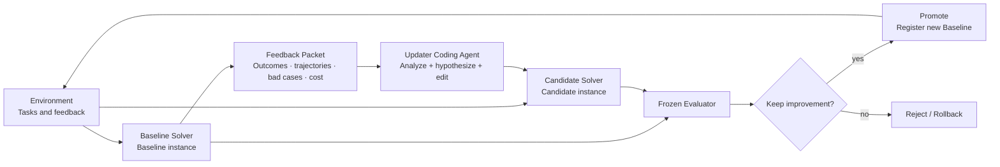

# DeepSeek Harness RSI

English | [中文](README.zh.md)

**An adapter-based recursive self-improvement control plane for coding agents, with DeepSeek Harness as the first Solver and Updater runtime.**

> [!IMPORTANT]
> The repository now includes a resumable Controller loop, configurable L1/L2/L3 mutation boundaries, model gateways, frozen evaluation, sealed test handling, sandboxed runtimes, and raw-curve reporting. A successful `campaign smoke` is still required before a production campaign; implementation readiness is not an experimental result.

The Controller also supports Single, Independent, Mutualism, Competition, and Combined population strategies through one frozen `controller_config`; see [Controller evolution modes](docs/controller-modes.md).

## Why this is no longer a DeepSeek Harness fork

An RSI system must control source instances, Updaters, task environments, external evaluation, candidate lineage, and rollback. Keeping all of that inside a DeepSeek Harness fork mixes the system being optimized with the system judging it and makes other coding agents unnecessarily difficult to integrate.

The relationship is now:

```text
DeepSeek-Harness-RSI (independent trusted control plane)
  -> sources/deepseek-harness (pinned integration submodule; read-only to the Updater)
  -> /mnt/data/hzy/03_dsh_rsi/dsh-rsi-runtime/... (isolated campaign/runtime storage)
  -> Updater edits one Candidate, never the source submodule
```

This preserves explicit upstream updates while allowing the same Controller to integrate other Solvers and Updaters through adapters.

## Core loop



**The Updater is not a collection of fixed diagnosis modules.** It is one coding-agent session that reads code and a batch of failure evidence, forms a hypothesis, and edits the candidate. The Controller handles deterministic materialization, permissions, execution, collection, evaluation, and promotion; it does not replace open-ended diagnosis with a fixed taxonomy.

## Mutation levels

| Level          | Writable in this run                                      | Isolation                         |
|----------------|-----------------------------------------------------------|-----------------------------------|
| L1 strategy    | Presets, prompts, personas, skills, tool descriptions     | Path allowlist; fast experiments  |
| L2 behavior    | Middleware, hooks, memory/router, workflows, tools/plugins | Isolated Candidate build and run |
| L3 Solver core | Agent loop, session/context, registries, adapters          | Full instance and regression isolation |
| External trust root | **Never writable at any level**                      | Separate process and storage      |

Layer selection is an adapter policy. Historical campaigns can use Controller-driven L1→L2→L3 sequencing; the current MSA-derived math/reasoning path uses `updater-soft`, where every prompt contains the complete configurable catalogue and the Updater chooses the smallest sufficient layer. The Controller performs only a lightweight Git audit of the declared layer and final changed paths.

## Repository layout

```text
.
├── controller/                 # Trusted orchestration, stores, runners, broker, reports
├── adapters/
│   ├── targets/                # Solver source, launch protocol, and L1/L2/L3 paths
│   └── updaters/               # Coding-agent runtime used for an Updater session
├── benchmarks/                 # Pinned data revision and validation/sealed-test manifests
├── evaluation/                 # Paired metrics, promotion policy, normalized results
├── environments/              # Task, trajectory, and evaluation environment protocol
├── prompts/                    # Shared high-level Updater instruction
├── sources/
│   └── deepseek-harness/       # Pinned Harness integration; read-only to the Updater
├── docs/                       # Architecture and design documents
└── scripts/                    # Reproducible production-host bootstrap and isolation setup
```

## Source and instance isolation

- `sources/deepseek-harness/` stores the trusted, pinned upstream-derived source revision.
- The lightweight path creates one campaign-owned Candidate worktree and separate Git metadata once, then reuses them across rounds.
- The Updater may edit the Candidate, but a commit is accepted for evaluation only when its declared layer and changed paths match the configured boundary.
- Baseline and Candidate run the same tasks under the frozen model contract and request budgets.
- Hidden tasks and final rubrics never enter the feedback packet, and self-reported candidate scores cannot promote a revision.
- Only the Controller can register a Candidate, advance the baseline pointer, or roll back.

See the [architecture document](docs/architecture.md) for the complete decision and runtime layout.

## Benchmark and Evaluator entry point

The production PutnamBench campaign is validated and preflighted with:

```bash
scripts/setup-putnambench-runtime.sh --repository-root "$PWD"
node controller/src/cli.mjs campaign validate

read -rsp 'ZCloud API key: ' RSI_API_KEY; printf '\n'
node controller/src/cli.mjs campaign smoke \
  --tasks 1 --zcloud-key-fd 3 3< <(printf '%s' "$RSI_API_KEY")
unset RSI_API_KEY
```

After the smoke passes, use `evolve start` for a new campaign, `evolve resume` only after an infrastructure pause, `evolve status` for a credential-free public status, and `evolve report` after closure. The main campaign is pinned to `gpt-5.6-sol`, Responses API, reasoning effort `max`. A backup provider always starts a separately fingerprinted campaign and never contributes points to the primary curve. See the [experiment protocol](docs/putnambench-evolution.md).

The generic paired Evaluator CLI remains available:

The CLI validates a Benchmark manifest and compares normalized Baseline/Candidate results:

```bash
npm run rsi -- benchmark validate \
  --config benchmarks/examples/swebench-rsi-smoke/benchmark.json

npm run rsi -- evaluate compare \
  --benchmark benchmarks/examples/swebench-rsi-smoke/benchmark.json \
  --policy evaluation/policies/rsi-mvp.json \
  --baseline evaluation/examples/selection-baseline.jsonl \
  --candidate evaluation/examples/selection-candidate.jsonl \
  --run-id smoke-selection-001 \
  --baseline-revision baseline-demo-v1 \
  --candidate-revision candidate-demo-v2 \
  --partitions feedback,selection \
  --evolution evaluation/examples/evolution-ledger.json
```

It reports resolved rate, paired net improvement, regressions, bootstrap intervals, tokens, cost, latency, policy violations, and promotion gates. See [Evaluator documentation](evaluation/README.md).

## Clone

```bash
git clone --branch hzy_dev --recurse-submodules https://github.com/DeepThinkingZhouLiu/Deepseek-Harness-RSI.git
cd Deepseek-Harness-RSI
git submodule update --init --recursive
```

## Pull an upstream DeepSeek Harness update

```bash
git submodule update --remote sources/deepseek-harness
git add sources/deepseek-harness
git commit -m "chore: update DeepSeek Harness submodule"
```

The `hzy_dev` branch follows the matching integration branch in [`ZhaoyangHan04/deepseek-harness`](https://github.com/ZhaoyangHan04/deepseek-harness/tree/hzy_dev), which carries the headless preset fix on top of the official history. The superproject still records a concrete SHA for reproducible experiments; upstream updates should first be integrated and verified on that submodule branch.

## Current experiment scope

- PutnamBench-Lean is the implemented production campaign; the generic SWE-bench adapter remains separate work.
- Mutations proceed outside-in: L1 declarative strategy, L2 extensions/tools, then L3 Solver core.
- The HLE math/reasoning experiment uses an MSA-derived minimal Target and soft Updater-selected layers, with no fixed three-miss transition rule.
- Promotion uses only a strict increase on 500 validation proofs. The 172-test partition stays sealed until closure and is never used for selection.
- Provider credentials enter through inherited file descriptors. Solver, Updater, Build, and Verifier use separate identities and fail-closed sandboxes.

## Upstream and license

This is not an official DeepSeek project. `sources/deepseek-harness/` derives from [deepseek-ai/deepseek-harness](https://github.com/deepseek-ai/deepseek-harness), with the development integration commit hosted in the [ZhaoyangHan04 fork](https://github.com/ZhaoyangHan04/deepseek-harness/tree/hzy_dev), and retains its own history and license. Controller, adapter, and documentation work in this repository is available under the [MIT License](LICENSE).
