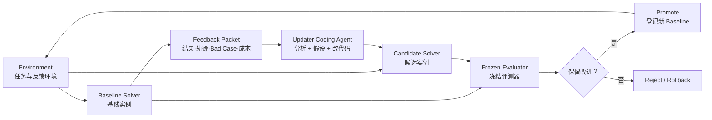

# DeepSeek Harness RSI

中文 | [English](README.md)

**一个面向 Coding Agent 的 Adapter 化递归自我改进控制平面，以 DeepSeek Harness 作为第一个 Solver 与 Updater Runtime。**

> [!IMPORTANT]
> 当前仓库已经完成“独立主仓 + 上游子模块 + Adapter/隔离契约”的结构重建，并提供第一版 Benchmark 校验与配对 Evaluator CLI；完整 Controller 进化闭环尚未实现，不代表已经具备无人值守自进化能力。

## 为什么不再做 DeepSeek Harness Fork

RSI 系统需要同时管理源码实例、Updater、任务环境、外部评测、候选谱系和回滚。如果把这些内容直接写进 DeepSeek Harness Fork，Updater 很容易把“被优化对象”和“裁判系统”混在同一个仓库里，也很难接入 pi-agent 等其他 Coding Agent。

现在的关系是：

```text
DeepSeek-Harness-RSI（独立仓库，可信控制平面）
  -> sources/deepseek-harness（固定的集成子模块；对 Updater 只读）
  -> .rsi/instances/...（Controller 生成的 Baseline/Candidate 实例）
  -> Updater 只修改某个 Candidate，不直接修改 Submodule
```

这样既能显式拉取 DeepSeek 上游更新，又能让同一套 RSI Controller 通过 Adapter 接入其他 Solver 和 Updater。

## 核心闭环



**Updater 不是四五个固定小模块。** 它就是一个能读代码、读一批失败轨迹并改代码的 Coding Agent。Controller 不替它做规则化归因，只负责确定性的实例化、权限限制、运行、收集、评测和晋升。

## 三个变异层级

| 层级            | 本轮允许修改                                             | 隔离要求                     |
|-----------------|----------------------------------------------------------|------------------------------|
| L1 策略层       | Preset、Prompt、Persona、Skill、工具描述和声明式配置     | 路径白名单，优先做快速实验   |
| L2 行为层       | Middleware、Hook、Memory/Router、Workflow、Tool、Plugin | 独立 Candidate 中构建与运行  |
| L3 Solver Core  | Agent Loop、Session/Context、Registry、Adapter 等源码    | 完整实例隔离与更严格回归评测 |
| 外部信任根      | **任何层级都不能修改**                                   | 与 Candidate 分进程、分存储  |

Controller 每轮只选择一个层级。Prompt 会告诉 Updater 能改什么，但真正的限制来自两道门：Updater 沙箱只挂载允许路径为可写；Updater 结束后，Controller 再拒绝所有越界 Diff。

## 目录结构

```text
.
├── controller/                 # 可信编排器的职责与未来实现入口
├── adapters/
│   ├── targets/                # Solver 源码、启动协议与 L1/L2/L3 路径
│   └── updaters/               # 用哪个 Coding Agent 启动 Updater Session
├── benchmarks/                 # 固定数据版本、Instance ID 与三段 Split
├── evaluation/                 # 配对指标、晋升 Policy 与标准化结果协议
├── environments/              # 任务、Trajectory 与评测环境协议
├── prompts/                    # Updater 的共享高层指令
├── sources/
│   └── deepseek-harness/       # 固定的 Harness 集成版本；对 Updater 只读
├── docs/                       # 架构与设计文档
└── .rsi/                       # 本地实例、反馈、产物与谱系；不进 Git
```

## 源码与实例如何隔离

- `sources/deepseek-harness/` 只保存 Controller 信任、由上游派生的固定源码版本。
- Controller 从这个固定提交创建独立 Baseline 和 Candidate Worktree。
- Updater 能读取完整 Candidate，但只有当前层级路径可写；其视野中不暴露 Controller 的 Git 元数据。
- Baseline 和 Candidate 在相同任务、模型、预算和随机种子下配对运行。
- 隐藏题与最终 Rubric 不进入反馈包；Candidate 自报的分数不作为晋升依据。
- 只有 Controller 可以登记 Candidate、更新基线指针或执行回滚。

更完整的决策与运行目录见 [架构文档](docs/architecture.zh.md)。

## Benchmark 与 Evaluator 入口

当前 CLI 可以校验 Benchmark Manifest，并对标准化 Baseline/Candidate 结果做配对比较：

```bash
npm run rsi -- benchmark validate \
  --config benchmarks/examples/swebench-rsi-smoke/benchmark.json

npm run rsi -- evaluate compare \
  --benchmark benchmarks/examples/swebench-rsi-smoke/benchmark.json \
  --policy evaluation/policies/rsi-mvp.json \
  --baseline evaluation/examples/selection-baseline.jsonl \
  --candidate evaluation/examples/selection-candidate.jsonl \
  --run-id smoke-selection-001 \
  --baseline-revision baseline-demo-v1 \
  --candidate-revision candidate-demo-v2 \
  --partitions feedback,selection \
  --evolution evaluation/examples/evolution-ledger.json
```

它已经计算 Resolved Rate、配对净提升、回退、Bootstrap 区间、Token、成本、延迟、安全违规和晋升 Gate。SWE-bench Docker Harness 的自动启动及官方报告归一化是下一步，详见 [Evaluator 说明](evaluation/README.md)。

## 获取仓库

```bash
git clone --recurse-submodules https://github.com/DeepThinkingZhouLiu/Deepseek-Harness-RSI.git
cd Deepseek-Harness-RSI
git submodule update --init --recursive
```

## 拉取 DeepSeek Harness 上游更新

```bash
git submodule update --remote sources/deepseek-harness
git add sources/deepseek-harness
git commit -m "chore: update DeepSeek Harness submodule"
```

当前主仓在官方历史之上固定了已审查的集成提交 [`3289531e06`](https://github.com/ZhaoyangHan04/deepseek-harness/commit/3289531e06e924abb790685f44baf67311f26ec9)，因为已发布的 headless profile 还不能正确组装逐会话 preset。`.gitmodules` 的正常更新通道仍是官方 `master`；推进子模块时必须保留这笔修复，或者换成包含等价修复的官方版本。

## 下一步

- 为 Target、Updater、Environment Adapter 补充正式 Schema 校验。
- 实现 Candidate 实例化、沙箱挂载和 Diff 白名单校验。
- 实现 SWE-bench Runner/Normalizer，将官方报告转换为标准 Solver Result。
- 跑通 `任务 -> 反馈包 -> Updater -> Candidate -> 配对评测 -> 决策` 的完整闭环。
- 先用 DeepSeek Harness 做 L1 实验，再进入 L2；L3 等隔离与回滚稳定后再开放。
- 增加 pi-agent Adapter，验证 Controller 是否真正与具体 Agent 解耦。

## 上游与许可

本项目不是 DeepSeek 官方项目。`sources/deepseek-harness/` 从 [deepseek-ai/deepseek-harness](https://github.com/deepseek-ai/deepseek-harness) 拉取，目前在官方历史之上固定了一笔经过审查的贡献者集成提交；该子模块保留独立历史与许可证，本仓库自己的 Controller、Adapter 和文档使用 [MIT License](LICENSE)。
