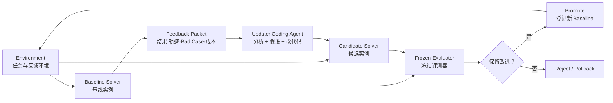

# DeepSeek Harness RSI

中文 | [English](README.md)

**一个面向 Coding Agent 的 Adapter 化递归自我改进控制平面，以 DeepSeek Harness 作为第一个 Solver 与 Updater Runtime。**

> [!IMPORTANT]
> 当前仓库已实现可恢复的 Controller 闭环、可配置 L1/L2/L3 变异边界、模型网关、冻结评测、sealed test 处理、沙箱运行时与原始曲线报告。正式实验前仍必须通过 `campaign smoke`；实现就绪不等于已经得到实验结果。

## 为什么不再做 DeepSeek Harness Fork

RSI 系统需要同时管理源码实例、Updater、任务环境、外部评测、候选谱系和回滚。如果把这些内容直接写进 DeepSeek Harness Fork，Updater 很容易把“被优化对象”和“裁判系统”混在同一个仓库里，也很难接入 pi-agent 等其他 Coding Agent。

现在的关系是：

```text
DeepSeek-Harness-RSI（独立仓库，可信控制平面）
  -> sources/deepseek-harness（固定的集成子模块；对 Updater 只读）
  -> /mnt/data/hzy/03_dsh_rsi/dsh-rsi-runtime/...（隔离的 Campaign 与 Runtime 存储）
  -> Updater 只修改某个 Candidate，不直接修改 Submodule
```

这样既能显式拉取 DeepSeek 上游更新，又能让同一套 RSI Controller 通过 Adapter 接入其他 Solver 和 Updater。

## 核心闭环



**Updater 不是四五个固定小模块。** 它就是一个能读代码、读一批失败轨迹并改代码的 Coding Agent。Controller 不替它做规则化归因，只负责确定性的实例化、权限限制、运行、收集、评测和晋升。

## 三个变异层级

| 层级            | 本轮允许修改                                             | 隔离要求                     |
|-----------------|----------------------------------------------------------|------------------------------|
| L1 策略层       | Preset、Prompt、Persona、Skill、工具描述和声明式配置     | 路径白名单，优先做快速实验   |
| L2 行为层       | Middleware、Hook、Memory/Router、Workflow、Tool、Plugin | 独立 Candidate 中构建与运行  |
| L3 Solver Core  | Agent Loop、Session/Context、Registry、Adapter 等源码    | 完整实例隔离与更严格回归评测 |
| 外部信任根      | **任何层级都不能修改**                                   | 与 Candidate 分进程、分存储  |

层级选择属于 Adapter Policy。历史 Campaign 可以继续使用 Controller 驱动的 L1→L2→L3 顺序；当前 MSA-derived math/reasoning 路径使用 `updater-soft`：每轮 Prompt 拼接完整可配置三层目录，由 Updater 选择最小充分层级，Controller 只对声明层级和最终改动路径做轻量 Git 审核。

## 目录结构

```text
.
├── controller/                 # 可信编排、状态存储、Runner、Broker 与报告
├── adapters/
│   ├── targets/                # Solver 源码、启动协议与 L1/L2/L3 路径
│   └── updaters/               # 用哪个 Coding Agent 启动 Updater Session
├── benchmarks/                 # 固定数据版本、验证集与 sealed 测试集 manifest
├── evaluation/                 # 配对指标、晋升 Policy 与标准化结果协议
├── environments/              # 任务、Trajectory 与评测环境协议
├── prompts/                    # Updater 的共享高层指令
├── sources/
│   └── deepseek-harness/       # 固定的 Harness 集成版本；对 Updater 只读
├── docs/                       # 架构与设计文档
└── scripts/                    # 可复现的开发机安装与隔离配置
```

## 源码与实例如何隔离

- `sources/deepseek-harness/` 只保存 Controller 信任、由上游派生的固定源码版本。
- 轻量路径只创建一次 Campaign 专属 Candidate worktree 与独立 Git 元数据，后续轮次持续复用。
- Updater 可以修改 Candidate，但只有声明层级和最终改动路径符合配置边界的 commit 才会进入评测。
- Baseline 和 Candidate 在相同任务、冻结模型契约和请求预算下运行。
- 隐藏题与最终 Rubric 不进入反馈包；Candidate 自报的分数不作为晋升依据。
- 只有 Controller 可以登记 Candidate、更新基线指针或执行回滚。

更完整的决策与运行目录见 [架构文档](docs/architecture.zh.md)。

## Benchmark 与 Evaluator 入口

生产用 PutnamBench Campaign 先校验、再做真实端到端预检：

```bash
scripts/setup-putnambench-runtime.sh --repository-root "$PWD"
node controller/src/cli.mjs campaign validate

read -rsp 'ZCloud API key: ' RSI_API_KEY; printf '\n'
node controller/src/cli.mjs campaign smoke \
  --tasks 1 --zcloud-key-fd 3 3< <(printf '%s' "$RSI_API_KEY")
unset RSI_API_KEY
```

Smoke 通过后，`evolve start` 启动新实验；只有基础设施暂停后才使用 `evolve resume`；`evolve status` 无需凭据且只显示公开状态；关闭后用 `evolve report`。主实验固定为 `gpt-5.6-sol`、Responses API、reasoning effort `max`。备用 Provider 必须启动 fingerprint 独立的新 Campaign，不能把点混入主曲线。完整约束见[实验协议](docs/putnambench-evolution.zh.md)。

通用配对 Evaluator CLI 仍然保留：

当前 CLI 可以校验 Benchmark Manifest，并对标准化 Baseline/Candidate 结果做配对比较：

```bash
npm run rsi -- benchmark validate \
  --config benchmarks/examples/swebench-rsi-smoke/benchmark.json

npm run rsi -- evaluate compare \
  --benchmark benchmarks/examples/swebench-rsi-smoke/benchmark.json \
  --policy evaluation/policies/rsi-mvp.json \
  --baseline evaluation/examples/selection-baseline.jsonl \
  --candidate evaluation/examples/selection-candidate.jsonl \
  --run-id smoke-selection-001 \
  --baseline-revision baseline-demo-v1 \
  --candidate-revision candidate-demo-v2 \
  --partitions feedback,selection \
  --evolution evaluation/examples/evolution-ledger.json
```

它计算 Resolved Rate、配对净提升、回退、Bootstrap 区间、Token、成本、延迟、安全违规和晋升 Gate，详见 [Evaluator 说明](evaluation/README.md)。

## 获取仓库

```bash
git clone --branch hzy_dev --recurse-submodules https://github.com/DeepThinkingZhouLiu/Deepseek-Harness-RSI.git
cd Deepseek-Harness-RSI
git submodule update --init --recursive
```

## 拉取 DeepSeek Harness 上游更新

```bash
git submodule update --remote sources/deepseek-harness
git add sources/deepseek-harness
git commit -m "chore: update DeepSeek Harness submodule"
```

`hzy_dev` 分支跟踪 [`ZhaoyangHan04/deepseek-harness`](https://github.com/ZhaoyangHan04/deepseek-harness/tree/hzy_dev) 中同名的集成分支；该分支在官方历史之上携带 headless preset 修复。主仓仍始终提交一个确定 SHA，保证实验可复现；新的官方上游提交应先集成到这个子模块分支并完成验证。

## 当前实验范围

- PutnamBench-Lean 是当前已经落地的生产 Campaign；通用 SWE-bench Adapter 仍是独立后续工作。
- 变异按从外到内执行：L1 声明式策略、L2 扩展与工具、L3 Solver Core。
- HLE math/reasoning 实验使用 MSA-derived minimal Target 和 Updater 自选软分层，不再采用固定三次 miss 升层规则。
- 只有 500 题验证集 verified 数严格上涨才晋升；172 题测试集在关闭前 sealed，绝不参与选择。
- Provider 凭据只经继承 FD 输入；Solver、Updater、Build、Verifier 使用独立身份与 fail-closed 沙箱。

## 上游与许可

本项目不是 DeepSeek 官方项目。`sources/deepseek-harness/` 派生自 [deepseek-ai/deepseek-harness](https://github.com/deepseek-ai/deepseek-harness)，开发集成提交托管在 [ZhaoyangHan04 fork](https://github.com/ZhaoyangHan04/deepseek-harness/tree/hzy_dev)，并保留其独立历史与许可证；本仓库自己的 Controller、Adapter 和文档使用 [MIT License](LICENSE)。
