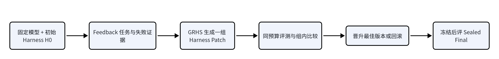

一句话讲清这篇 Paper：EvoCowork 是一个“Benchmark + 自进化算法”项目。Benchmark 评测同一个底座模型在做过一批真实 Office 任务后，能否通过修改 Prompt、Skill、Memory、工具或控制流等 Harness 组件，在未见任务上获得真实提升；参考算法 GRHS 负责自动生成、比较并筛选这些 Harness 修改。
你负责的核心任务：基于 HarnessEvoGym 现有 Infra，实现论文中的 GRHS Controller 最小可运行版本，并先跑通一轮小规模 Office 实验。
项目入口
入口
用途
Overleaf Paper
EvoCowork 可编辑邀请链接
GitHub Infra
HarnessEvoGym
研究说明
Co work - RSI-Bench
这篇 Paper 在测什么
EvoCowork 不只是测一个 Agent 当前能不能完成 PPT、Word、Excel 或跨 Office 工作流，而是测：固定模型、工具、预算和 Judge 后，哪种 Harness 自进化算法能从历史经验中学到可迁移的改进。可见的 feedback 任务用于发现问题，selection 任务用于选择版本，sealed final 任务只在最终版本冻结后评一次，防止把测试集用成训练集。

这条链路的重点是：模型参数不变，变化的是 Harness；Judge、数据划分和控制平面始终不变。
你的任务：实现 GRHS Controller MVP
当前 Infra 已经具备 Candidate、MutationLease、Updater、OfficeVal、Evaluator、Promotion/rollback 和日志等基础能力，但现有 SearchStrategy 主要是“每轮提出一个 MutationPlan”。完整 GRHS 需要“从同一父版本生成一组兄弟 Candidate，再计算组内相对优势”，因此不能只写一个普通 Region 选择器；需要在复用现有可信组件的基础上，补一个最小的 Group Controller / 调度与打分逻辑。
阶段
要做什么
最小产出
1
读 Paper 和 Infra
把 GRHS 的候选生成、评测、组内打分、晋升/回滚映射到现有模块。
2
生成 Candidate Group
同一个 Champion 下生成至少 2 个离散 Harness Patch；每个 Patch 只能改 MutationLease 允许的 Region。
3
实现 GRHS 打分
组合质量提升、回退、成本和 Patch 复杂度得到 utility，并在组内标准化为 relative advantage。
4
选择并更新
选择最佳 Candidate 晋升；没有合格改进则回滚。记录 lineage、utility、advantage 和 proposal prior/state。
5
跑通一次
在 OfficeVal 小规模 smoke 上完成 H0 → 两个 Candidate → 评测 → 晋升/回滚的完整一轮。
建议从这些代码开始
- cowork-orchestrator.mjs：现有单 Candidate 进化主流程。
- search-strategy.mjs：Strategy 的 propose / observe 协议与脱敏边界。
- evaluator.mjs：配对评测、Gate 和 promotion decision。
- round-robin Strategy 示例：外部算法插件的最小结构。
- CONTRIBUTING.md：扩展协议、测试和安全边界。
实现原则：优先复用现有 Candidate、Lease、Updater、Evaluator 和持久化逻辑；如果当前 Strategy 协议拿不到 GRHS 必需的候选组、质量、成本或复杂度信息，再做最小、可测试的协议扩展，不重写整套 Infra。
跑通标准
- 可运行：固定同一 H0、模型、Seed 和预算，至少生成并评测 2 个兄弟 Candidate。
- 可审计：日志能还原 parent、patch、region、utility、relative advantage、最终晋升或回滚决定。
- 不泄漏：算法不能读取或修改 Judge、Rubric、Benchmark Split、凭据和 Sealed Final。
- 有测试：覆盖确定性、组内打分、平分、失败 Candidate、预算耗尽和 rollback；通过 npm run check、npm test 与 experiment validate。
最终交付
1. 一份 GRHS Controller / Strategy 代码与配置；
2. 相关单元测试和最小 E2E 测试；
3. 一次 OfficeVal smoke 的 Run ID、日志和结果摘要；
4. 一段简短说明：实现了什么、与 Paper 的对应关系、当前还缺什么。
第一阶段不追求大规模结果。先把一轮 GRHS 从候选生成到 promotion/rollback 真正跑通，再扩到更多 Candidate、更多轮次和正式 Benchmark。